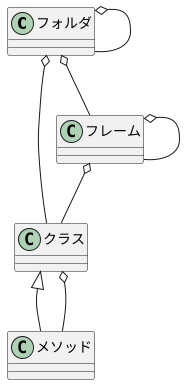

# 設計

## PlantSimの構造



- メソッドの所在は3種類ある


- フォルダ直下のメソッドはクラス
  - staticに実行はできる
  - フレームなどにインスタンスとして配置もできる


- フレーム直下のメソッドはインスタンス


- クラス直下のメソッドはクラス
  - クラスのインスタンスから実行できる
  - クラスがメソッドになることもできる

## パースを考える

- Pathの概念があってxxx.yyy.zzzと`.`でつなぐ
  - インスタンスであっても同じ
- メソッドだけに注目すればディレクトリツリーでまま構造を再現すれば何とかなりそう
  ```plantuml
  @startsalt
  {
  {T
  + RootFolder
  ++ Folder1
  +++ Folder2
  ++++ Class1
  +++++ Method
  ++ Frame1
  +++ Method
  +++ Class1Instance
  ++++ Method(Override)
  ++++ Method(Append)
  ++ Class2
  +++ Method
  }
  }
  @endsalt
  ```
  OverrideかAppendか区別しないといけないのに注意は必要
  Folder->Class->StaticMethod->Frameの順にパースしないとOverrideがおかしくなる

- ディレクトリツリーのパース
  - ファイルはメソッド(.simtalkに限定してもいいかも)
  - ディレクトリはFolder or Frame or Class
    - Prefixで判断にするか
      |種類|Prefix|
      |:--|:--|
      |Folder|何もつけない(無印)|
      |Frame|Frame or F|
      |Class|Class or C|
      - インスタンスも構造上はClassでいいか
        - Frame下はインスタンスしかありえないから判断は可能

# 設計

- srcのroot以下がモデルと同じ構造化されてるとして...

```plantuml

autoactivate on

participant main
participant folder
participant file

main -> folder: find
return folders, files

```


var src_files : list

src_files := getFilesOfFolder(".\src\*\*.simtalk")

debug


model内にautoexecを置く

関数内にreload的なメソッドを用意して、↑をloadする

Loadされる側で各メソッドと対象ファイルパスの組で列挙されたload命令を書いておいて、それをautoexecで実行

Loadされるファイルは拡張側で自動生成するようにする